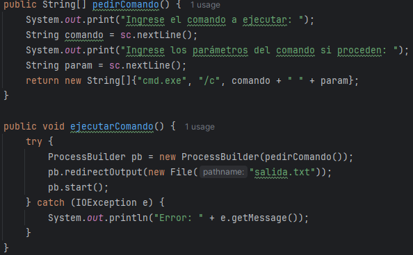

# Programación de Procesos

##### 👤 Autor: Ana Valladares González

---

## **Introducción a los Procesos y Hilos**  

### **¿Qué es un proceso?**  
Un **proceso** es un programa en ejecución. Cada vez que ejecutas una aplicación en tu ordenador, se crea un proceso para manejarla.  

### **¿Qué es un hilo?**  
Un **hilo** es la unidad más pequeña de ejecución dentro de un proceso. Los hilos permiten realizar varias tareas al mismo tiempo dentro de un proceso.  

---  

## **Trabajar con Procesos en Java**  

### **Clase `java.lang.Runtime`**  

La clase Runtime te permite ejecutar programas o comandos externos desde un programa en Java.

```java
try {
    // Ejecuta el bloc de notas
    Runtime.getRuntime().exec("notepad.exe");

    // Ejecuta el bloc de notas, indicando que prueba.txt es el archivo que se va a abrir o crear
    Runtime.getRuntime().exec("notepad.exe prueba.txt");

    // Ejecuta el bloc de notas, utilizando un array de Strings
    String[] procesoAEjecutar = {"notepad.exe", "prueba.txt"};
    Runtime.getRuntime().exec(procesoAEjecutar);
} catch (IOException e) {
    System.out.println("Error: " + e.getMessage());
}
```

### **Clase `java.lang.ProcessBuilder`**  

La clase `ProcessBuilder` proporciona un control más avanzado sobre los procesos. Permite configurar el entorno, redirigir entradas y salidas, entre otros.  

#### **Ejemplo básico:**  

```java
ProcessBuilder pb = new ProcessBuilder("notepad.exe", "archivo.txt");
Process proceso = pb.start(); // Inicia el proceso
```

#### **Métodos de la clase ProcessBuilder**

- `start()`: Inicia el proceso.
- `command()`: Devuelve el comando que se utilizó para ejecutar el proceso.
- `directory()`: Devuelve el directorio de trabajo del proceso.
- `environment()`: Devuelve el entorno del proceso.
- `redirectInput()`: Redirige la entrada del proceso (sirve para redirigir la entrada de un proceso a un archivo).
- `redirectOutput()`: Redirige la salida del proceso (sirve para redirigir la salida de un proceso a un archivo).
- `inheritIO()`: Hereda la entrada, salida y error del proceso.

#### **Redirección de entrada y salida:**  

Ejemplo de salida:
```java
ProcessBuilder pb = new ProcessBuilder("ls", "-l");
pb.redirectOutput(new File("salida.txt")); // Guarda la salida en un archivo
pb.start();
```

Ejemplo de entrada:
```java
ProcessBuilder pb = new ProcessBuilder("wc", "-l");
pb.redirectInput(new File("entrada.txt")); // Lee la entrada desde un archivo
pb.start();
```

Ejercicio 4:

>[!IMPORTANT]
> En Linux, en vez de `cmd.exe /c`, se utiliza `bash -c`.



### **Clase `java.lang.Process`**  

La clase `Process` representa un proceso en ejecución. Permite manejar su estado, capturar su salida o destruirlo.  

#### **Ejemplo: Capturar la salida de un proceso:**  

```java
Process p = Runtime.getRuntime().exec("ping google.com");
BufferedReader br = new BufferedReader(new InputStreamReader(p.getInputStream()));
String linea;
while ((linea = br.readLine()) != null) {
    System.out.println(linea);
}
br.close();
```

#### **Métodos de la clase Process**

- `InputStream getInputStream()`: Devuelve la entrada del proceso.
- `int exitValue()`: Devuelve el valor de salida del proceso.
- `boolean isAlive()`: Devuelve si el proceso está vivo.
- `int waitFor()`: Espera a que el proceso termine.
- `boolean waitFor(long timeout, TimeUnit unit)`: Espera a que el proceso termine durante un tiempo determinado.
- `void Destroy()`: Destruye el proceso.
- 
---

## **Trabajar con Hilos en Java**  

### **Clase `java.lang.Thread`**  

Un **hilo** se puede crear extendiendo la clase `Thread` y sobreescribiendo su método `run()`.  

> [!NOTE]
> Los hilos solo arrancan al ejecutar el método `start()` [que llama al método `run()`], no al crearlos.

#### **Ejemplo básico:**  

```java
Thread hilo = new Thread(() -> System.out.println("Hilo ejecutado"));
hilo.start(); // Inicia el hilo
```

#### **Métodos útiles:**  

- **`start()`**: Inicia el hilo.  
- **`sleep(long ms)`**: Pausa el hilo durante un tiempo en milisegundos.  
- **`join()`**: Hace que el hilo actual espere a que otro hilo termine.  

```java
Thread hilo = new Thread(() -> System.out.println("Hilo ejecutado"));
hilo.start();
hilo.join(); // Espera a que el hilo termine
System.out.println("Hilo finalizado");
```

---

### **Interfaz `java.lang.Runnable`**  

La interfaz `Runnable` es otra forma de crear hilos. Es útil si necesitas que tu clase extienda otra clase además de manejar hilos.  

#### **Ejemplo:**  

```java
Runnable tarea = () -> System.out.println("Hilo ejecutado");
Thread hilo = new Thread(tarea);
hilo.start();
```

---

### **Prioridades de Hilos**  

Puedes asignar prioridades a los hilos con los métodos `setPriority()` y `getPriority()`.  

```java
Thread hilo = new Thread();
hilo.setPriority(Thread.MAX_PRIORITY); // Prioridad máxima
System.out.println("Prioridad: " + hilo.getPriority());
```

#### Posibilidades de prioridades

- `Thread.MIN_PRIORITY`: Prioridad mínima.
- `Thread.NORM_PRIORITY`: Prioridad normal.
- `Thread.MAX_PRIORITY`: Prioridad máxima.
- `Thread.currentThread().getPriority()`: Prioridad del hilo actual.
- `Thread.currentThread().setPriority(int priority)`: Establece la prioridad del hilo actual (0-10, siendo 0 la prioridad mínima y 10 la máxima).

---

## **Conceptos Avanzados**  

### **Variables de Acceso Compartido**  

Cuando varios hilos necesitan acceder a la misma variable, pueden ocurrir errores si no se sincroniza correctamente.  

#### **Uso de `synchronized`:**  

```java
public synchronized void incrementar() {
    contador++;
}
```

#### **Ejemplo Completo:**  

```java
public class Contador {
    private int contador = 0;

    public synchronized void incrementar() {
        contador++;
    }

    public int getContador() {
        return contador;
    }
}

public class Hilo extends Thread {
    private Contador contador;

    public Hilo(Contador contador) {
        this.contador = contador;
    }

    @Override
    public void run() {
        for (int i = 0; i < 100; i++) {
            contador.incrementar();
            try {
                sleep(100);
            } catch (InterruptedException e) {
                e.printStackTrace();
            }
        }
    }
}

public class Main {
    public static void main(String[] args) {
        Contador contador = new Contador();
        Hilo hilo1 = new Hilo(contador);
        Hilo hilo2 = new Hilo(contador);
        Hilo hilo3 = new Hilo(contador);
        Hilo hilo4 = new Hilo(contador);
        hilo1.start();
        hilo2.start();
        hilo3.start();
        hilo4.start();
        try {
            hilo1.join();
            hilo2.join();
            hilo3.join();
            hilo4.join();
        } catch (InterruptedException e) {
            e.printStackTrace();
        }
        System.out.println("Contador: " + contador.getContador());
    }
}
```

---

### **Pipelines**  

Un **pipeline** conecta varios procesos en serie. La salida de un proceso sirve como entrada del siguiente.  

#### **Ejemplo:**  

```java
List<ProcessBuilder> procesos = Arrays.asList(
    new ProcessBuilder("ls", "-l"),
    new ProcessBuilder("grep", "java"),
    new ProcessBuilder("wc", "-l")
);
List<Process> pipes = ProcessBuilder.startPipeline(procesos);
```

---

### **Información de los Procesos**  

La clase `ProcessHandle` permite obtener información de los procesos en ejecución.  

```java
ProcessHandle ph = ProcessHandle.current();
ProcessHandle.Info info = ph.info();

System.out.println("PID: " + ph.pid());
System.out.println("Usuario: " + info.user().orElse("Desconocido"));
System.out.println("Comando: " + info.command().orElse("Desconocido"));
```