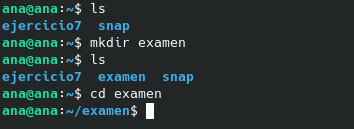
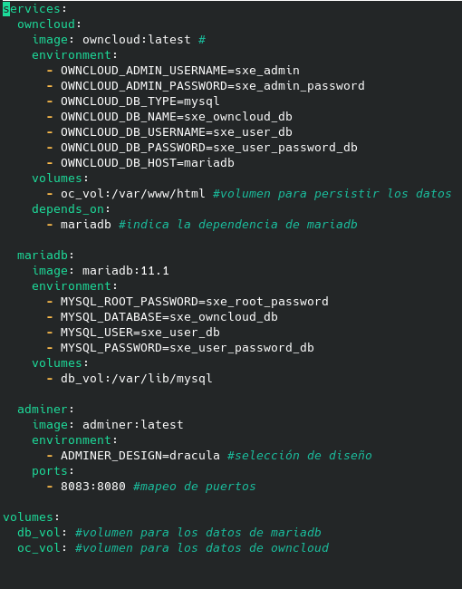
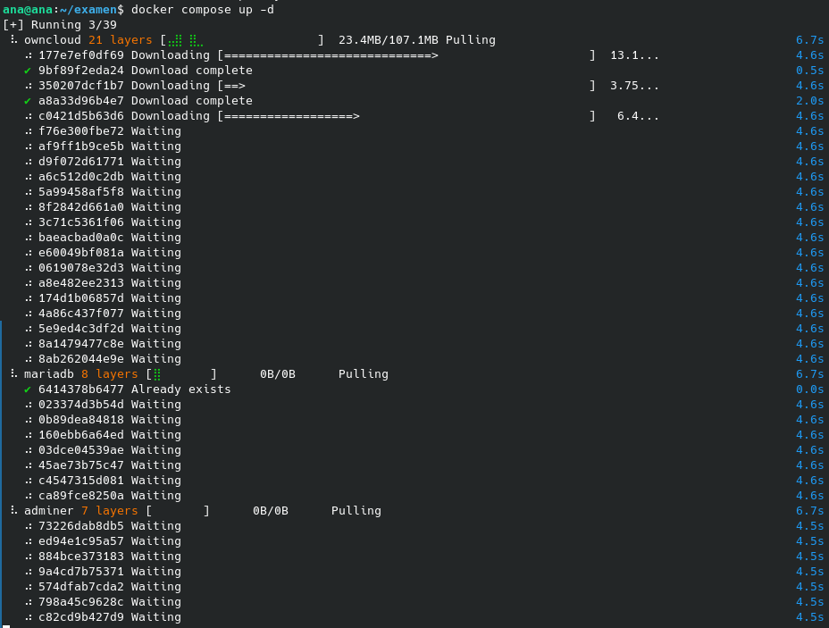
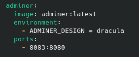
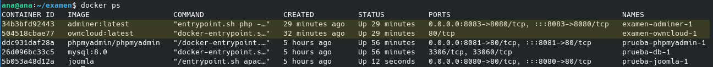
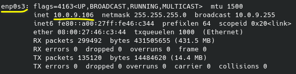
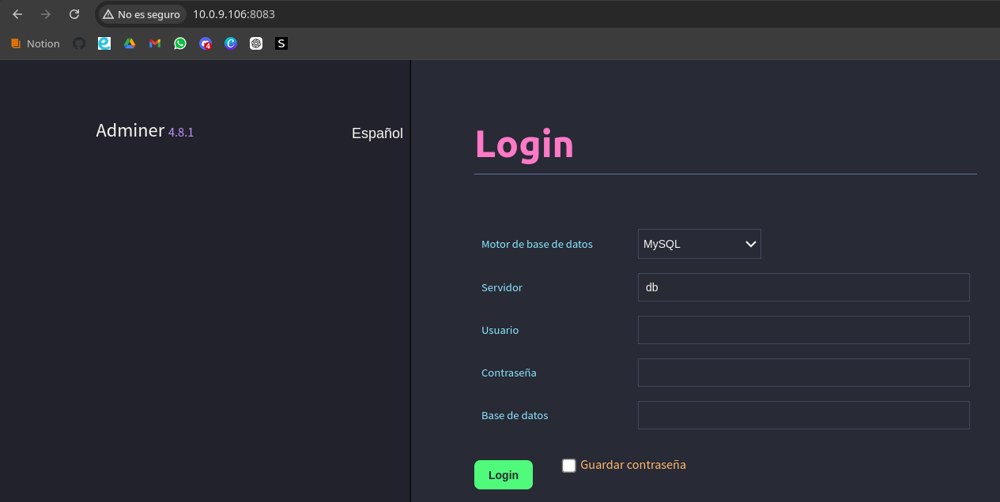
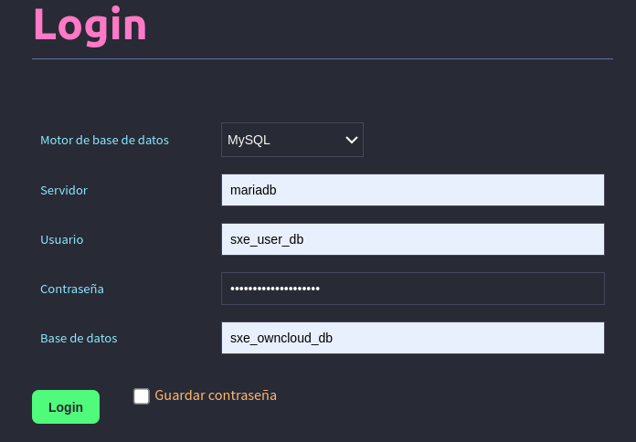
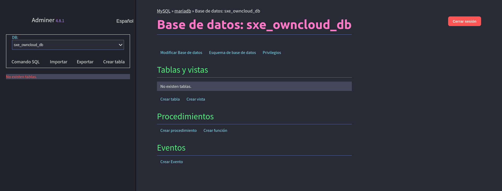

# Examen.

## Parte Práctica

1. **Creamos una nueva carpeta para el examen y entramos en ella:**
   
    ```bash
    mkdir examen
    cd examen
    ```

    

2. **Creamos el archivo docker-compose.yml:**
    ```bash
    nano docker-compose.yml
    ``` 

3. **Añadimos el contenido de la siguiente imagen al docker-compose.yml.**

    

4. **Ejecutamos el .yml para que surtan efecto todas las configuraciones que hemos realizado en el documento, mediante el siguiente comando:**

    ```bash
    docker compose up -d
    ```

    

    En mi caso, me ha dado un error diciendo que el puerto 8080 ya estaba en uso, por lo cual lo he cambiado al 8081, pero también estaba utilizado, así que he acabado modificando el puerto de adminer, al número 8083.

    

    Con `docker ps`, visualizamos que realmente se han creado los contenedores y que todo está ejecutándose correctamente.

    

5. **Para comprobar si funciona lo que hemos realizado, debemos ejecutarlo en el navegador, por lo que, si tuvieramos la máquina virtual configurada en modo NAT, simplemente con poner `localhost` ya entraría, pero como en mi caso estoy con adaptador puente, necesitamos buscar la IP de mi máquina virtual, lo cúal procederemos a hacer con el comando `ifconfig`, el cuál nos dirá la ip de nuestra máquina, en el apartado *enp0s3*.**

    

6. **Intentamos entrar desde un navegador, poniendo en la ruta a buscar la IP, junto con el puerto al que hemos dirigido la imagen, en mi caso: `http://10.0.9.106:8083/`**

    

7. **El último paso a realizar es iniciar sesión con las variables que hemos configurado en el archivo *docker-compose.yml*.**

    En nuestro caso, los valores serán los siguientes:
        - Motor de base de datos: *MySQL*
        - Servidor: *mariadb*
        - Usuario: *sxe_user_db*
        - Contraseña: *sxe_user_password_db*
        - Base de datos: *sxe_owncloud_db*

    

    Una vez accedemos, si hemos hecho todo bien, nos debe salir la siguiente pestaña:

    

---

## Parte Terórica

1. **Si ejecutas un contenedor con el siguiente comando: `docker run -it alpine`, ¿qué sucederá cuando salgas de la sesión interactiva del contenedor? ¿Por qué el contenedor se detiene automáticamente?**

    *El contenedor se detendrá automáticamente porque cuando este proceso termina, el contenedor no tiene más procesos en ejecución y Docker lo detiene.*

2. **Si lanzas un contenedor de Docker sin usar volúmenes ni “bind mount”, y luego haces cambios dentro del contenedor (como crear archivos o carpetas), ¿se mantendrán esos cambios cuando detengas el contenedor y lo vuelvas a arrancar? ¿Por qué?**

    *No, los cambios no se mantendrán porque cuando detenemos y eliminamos el contenedor, todos los cambios hechos dentro de él se pierden. Para poder persistir los datos, necesitamos usar volúmenes o bind mounts.*

3. **Si dentro de un archivo docker compose tienes todos los servicios vinculados a una red (network) definida en el mismo archivo docker-compose, detienes los contenedores con docker-compose down y luego los inicias nuevamente con docker-compose up, ¿funcionará correctamente? ¿por qué?** 

    *Sí, funcionará correctamente porque docker-compose down elimina los contenedores, redes y volúmenes definidos en el archivo docker-compose.yml, pero al volver a ejecutar docker-compose up, se recrearán todo de nuevo, restableciendo la conectividad entre los contenedores.*
    